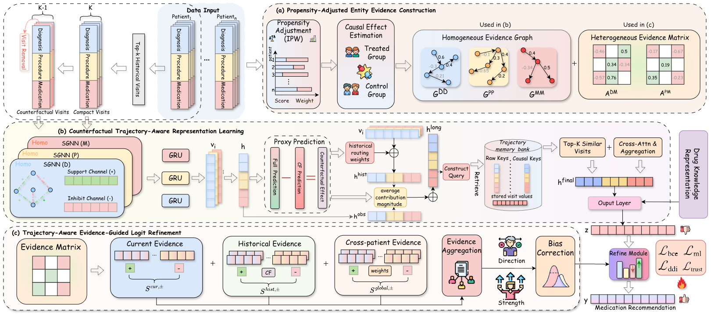

# TRAIL: Trajectory-Aware Reasoning via Multi-Source Evidence Integration and Logit Refinement for Medication Recommendation

<div align="center">

[](https://github.com/luumod/TRAIL)
[](https://www.python.org/)
[](https://pytorch.org/)
[](#data-preparation)

</div>

This repository contains the official implementation of **TRAIL**, a trajectory-aware reasoning framework for medication recommendation. TRAIL turns current clinical entities, longitudinal treatment history, and experience from trajectory-consistent patients into medication-specific evidence, then uses that evidence to refine prediction logits with signed and bounded residual updates.

> The repository provides model code, training and evaluation entry points, and preprocessing scripts. Raw or processed MIMIC data, checkpoints, logs, and hyperparameter-search artifacts are not distributed.

## Overview

Medication recommendation must account for a patient's current condition, prior treatment trajectory, and medication risks. Existing approaches often compress these heterogeneous signals into a single latent representation, which makes it difficult to determine whether a particular entity, historical visit, or similar-patient experience supports or inhibits an individual medication.

TRAIL addresses this limitation through three coupled components:

1. **Propensity-adjusted entity evidence construction** reduces spurious co-occurrence effects and builds signed evidence graphs and matrices.
2. **Counterfactual trajectory-aware representation learning** identifies medication-specific historical contributions through visit removal and retrieves complementary evidence from trajectory-consistent patients.
3. **Trajectory-aware evidence-guided logit refinement** aggregates current, historical, and cross-patient evidence into signed, bounded updates to the base medication logits.

<div align="center">
  
</div>

## Key Contributions

- We formulate medication recommendation as a trajectory-aware evidence reasoning problem in which each clinical signal has patient-medication-specific relevance and a supportive or inhibitory direction.
- We combine propensity-adjusted entity associations, counterfactual historical attribution, and trajectory-consistent cross-patient retrieval to construct multi-source evidence.
- We introduce bounded evidence-guided logit refinement that promotes supported medications, suppresses unsupported candidates, and limits excessive deviation from reliable base predictions.
- Experiments on MIMIC-III and MIMIC-IV demonstrate state-of-the-art recommendation performance and a favorable accuracy-safety balance.

## Results

The paper reports mean results over five independent runs. Higher is better for Jaccard, PRAUC, F1, and HM J-DDI; lower is better for DDI.

| Dataset | Jaccard | PRAUC | F1 | DDI | HM J-DDI |
| --- | ---: | ---: | ---: | ---: | ---: |
| MIMIC-III | **0.5392** | **0.7834** | **0.6916** | 0.0732 | **0.6818** |
| MIMIC-IV | **0.5075** | **0.7642** | **0.6701** | 0.0737 | **0.6557** |

The optional DDI-regularized variant reduces the DDI rate to 0.0652 on MIMIC-III and 0.0637 on MIMIC-IV while remaining competitive on recommendation accuracy.

## Repository Structure

```text
TRAIL/
|-- data/
|   |-- processing-iii.py       # MIMIC-III preprocessing
|   `-- processing-iv.py        # MIMIC-IV preprocessing
|-- doc/
|   `-- framework.png           # TRAIL framework
|-- scripts/
|   |-- train_mimiciii.sh
|   `-- train_mimiciv.sh
|-- src/
|   |-- main_train.py           # Training and evaluation entry point
|   |-- models.py               # TRAIL model
|   |-- util.py
|   `-- modules/                # Evidence, graph, trajectory, and memory modules
|-- requirements.txt
`-- README.md
```

## Usage

### Installation

```bash
git clone https://github.com/luumod/TRAIL.git
cd TRAIL

python -m venv .venv
# Linux/macOS
source .venv/bin/activate
# Windows PowerShell: .venv\Scripts\Activate.ps1

pip install -r requirements.txt
```

The causal-discovery components use CDT/GES and may require an R installation compatible with [CDT](https://fentechsolutions.github.io/CausalDiscoveryToolbox/html/index.html).

### Data Preparation

1. Obtain authorized access to [MIMIC-III](https://physionet.org/content/mimiciii/1.4/) or [MIMIC-IV](https://physionet.org/content/mimiciv/).
2. Prepare the prescriptions, diagnoses, and procedures tables from the selected MIMIC release.
3. Place the auxiliary resources in `data/input/`: `ndc2atc_level4.csv`, `drug-atc.csv`, `ndc2rxnorm_mapping.txt`, `drug-DDI.csv`, and `drugbank_drugs_info.csv`.
4. Use the processing functions and path configuration in `data/processing-iii.py` or `data/processing-iv.py` to build the required artifacts for your local MIMIC release.

> **Note:** The released preprocessing files provide reusable processing functions and document the expected inputs, but intentionally stop before executing an end-to-end pipeline. Review the raw CSV schema for your authorized MIMIC release and assemble the relevant stages locally.

The training entry point expects the following processed layout:

```text
data/output/
|-- mimic-iii/
|   |-- records_final.pkl
|   |-- voc_final.pkl
|   |-- ehr_adj_final.pkl
|   |-- ddi_A_final.pkl
|   |-- ddi_mask_H.pkl
|   `-- atc3toSMILES.pkl
`-- mimic-iv/
    |-- records_final.pkl
    |-- voc_final.pkl
    |-- ehr_adj_final.pkl
    |-- ddi_A_final.pkl
    |-- ddi_mask_H.pkl
    `-- atc3toSMILES.pkl
```

MIMIC data are governed by the PhysioNet credentialing and data-use requirements and therefore cannot be included in this repository.

### Training

Run TRAIL on MIMIC-III:

```bash
python src/main_train.py \
  --dataset mimic-iii \
  --device cuda:0 \
  --epochs 30 \
  --commit mimiciii_run
```

Run TRAIL on MIMIC-IV:

```bash
python src/main_train.py \
  --dataset mimic-iv \
  --device cuda:0 \
  --epochs 30 \
  --commit mimiciv_run
```

Equivalent launch scripts are available in `scripts/train_mimiciii.sh` and `scripts/train_mimiciv.sh`. Paper-default model settings are fixed in `src/main_train.py`; the command-line interface exposes the primary runtime options.

To use processed data stored elsewhere, pass `--data_dir`:

```bash
python src/main_train.py --dataset mimic-iii --data_dir /path/to/processed/mimic-iii
```

Checkpoints, TensorBoard logs, training history, and `metrics_summary.json` are written under `save/CSDG-Rec/<commit>/` by default.

### Evaluation

Evaluate a saved checkpoint with bootstrap resampling:

```bash
python src/main_train.py \
  --dataset mimic-iii \
  --device cuda:0 \
  --test \
  --resume_path /path/to/checkpoint.model
```

Use `python src/main_train.py --help` to inspect all public runtime options.

## Citation

If you find this work useful, please cite the TRAIL paper. The final BibTeX entry will be added after publication metadata become available.

```text
Lianghao Yu, Cong Wang, Yishuo Li, Xu Zhang, Cheng Li, Jianbin Guo, Wenpeng Lu. TRAIL: Trajectory-Aware Reasoning via Multi-Source Evidence Integration and Logit Refinement for Medication Recommendation. In Proceedings of the 2026 IEEE International Conference on Bioinformatics and Biomedicine [C]. Dallas, USA, 2026. (CCF B)
```

## Acknowledgements

This implementation builds on publicly available EHR resources from [PhysioNet](https://physionet.org/) and auxiliary medication knowledge from [DrugBank](https://go.drugbank.com/). We thank the authors and maintainers of the open-source medication recommendation and causal discovery tools used in this project.

## Disclaimer

TRAIL is provided for research purposes only. It is not a medical device and must not be used to make clinical decisions without review by qualified healthcare professionals.
